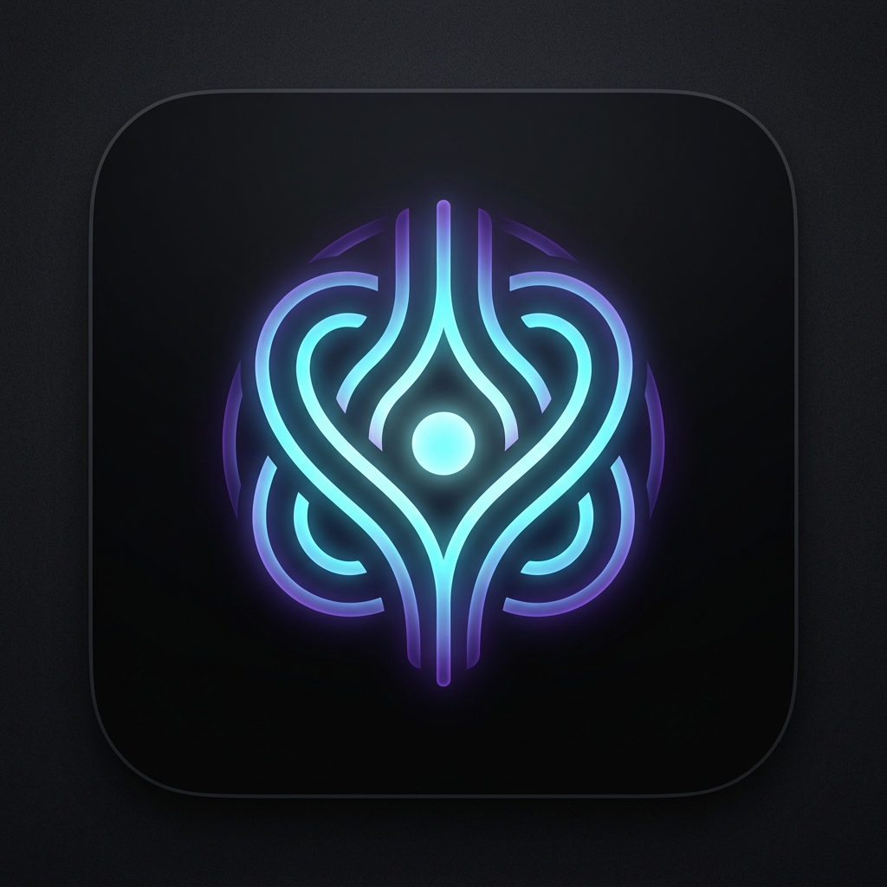
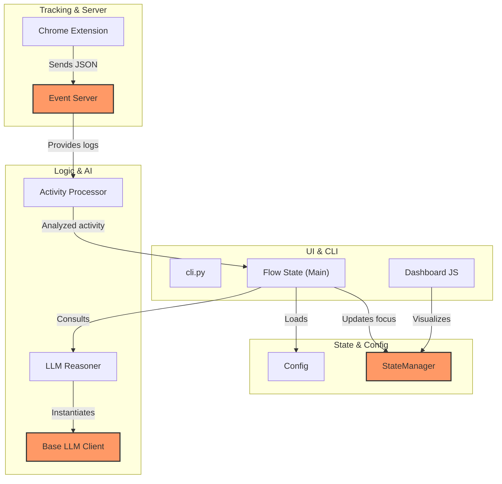
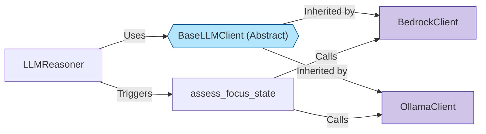
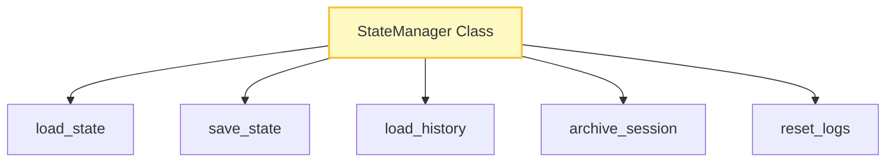
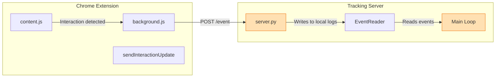

<div align="center">




# Flow State

**A smart, AI-powered focus monitoring system that tracks your browser activity and gently prevents you from drifting away from your goals.**

[](https://www.python.org/downloads/)
[](https://www.microsoft.com/windows/)
[](https://www.google.com/chrome/)

</div>

---

## ⚡ What is Flow State?

Flow State transforms how you work by maintaining contexts. You declare what you want to achieve, and a background AI agent continuously analyzes your open tabs and active Chrome session state. If you start doomscrolling or fall down a rabbit hole, Flow State instantly catches on, calculates a confidence score, and gently nudges you back to reality.

Privacy is paramount—it can operate **entirely offline** via Ollama to guarantee your browsing data never leaves your device.

## 🚀 Complete Step-by-Step Guide

### 1. Installation & Environment Setup
First, ensure you have Python 3.8+ installed. Then, clone the repository and install the requirements:
```bash
# Install dependencies
pip install -r requirements.txt

# Install Flow State locally
pip install .
```

### 2. Setting up the Chrome Extension
The extension is the "eyes" of Flow State. It tracks your active tab and sends it to the server.
1. Open Google Chrome and go to `chrome://extensions/`.
2. Turn on **Developer mode** in the top right.
3. Click **Load unpacked** and select the `flow-state-chrome-extension` folder from this project.

### 3. Choosing your AI Brain (Ollama or AWS)
Flow State needs an LLM to decide if you are drifting.
- **Ollama (Recommended/Free):** Install [Ollama](https://ollama.com/), run `ollama run qwen2.5`, and you're ready. No keys!
- **AWS Bedrock:** If you have an AWS account with Bedrock access, run `aws configure` to set your credentials.

### 4. Running the System
You can start the server and the monitoring agent in one command:
```bash
# Start monitoring with your current goal
flow-state --goal "Complete my focus dashboard implementation"
```
*Note: This command automatically starts the internal event server on port 3333.*

### 5. Using the Dashboard
Once the system is running, open your browser to:
**[http://localhost:3333/dashboard](http://localhost:3333/dashboard)**

### 6. Managing Goals
You can change your goal at any time without restarting the server:
```bash
flow-state-goal --set "Write the documentation for my new project"
```

---

## 🏗️ Architecture & Control Flow

How Flow State orchestrates Chrome events, AI reasoning, and notifications under the hood.

### 1. High-Level Pipeline


### 2. AI Service Architecture


### 3. State & Persistence Hub


### 4. The Event Lifeline (Data Ingestion)


---

## ⚙️ AI Providers

Flow State allows you to pick your AI processing methodology depending on how you prioritize cost vs quality vs privacy. Modify these settings in `~/.flow-state/config.json` after running the application for the first time.

- **Ollama**: Default configuration. Free, completely private, and runs entirely on-device (We recommend `qwen2.5` or `llama3`). 
- **AWS Bedrock**: Ultra-fast and highly accurate cloud processing via Claude 3.5 Sonnet. Requires standard AWS credentials setup in your local environment.

## 📄 License

MIT. See `LICENSE` for details.
